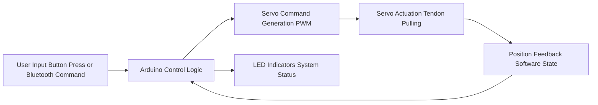
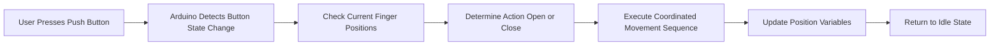
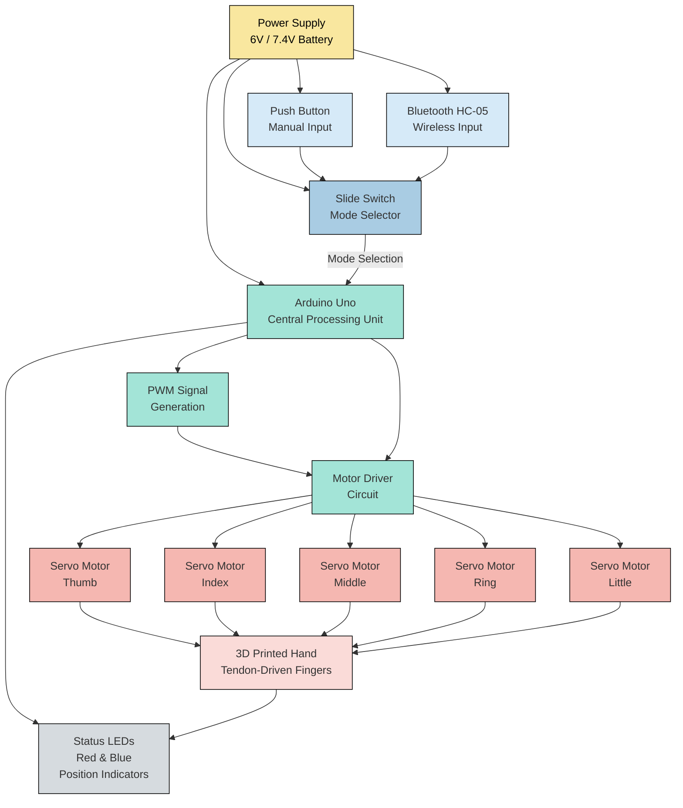
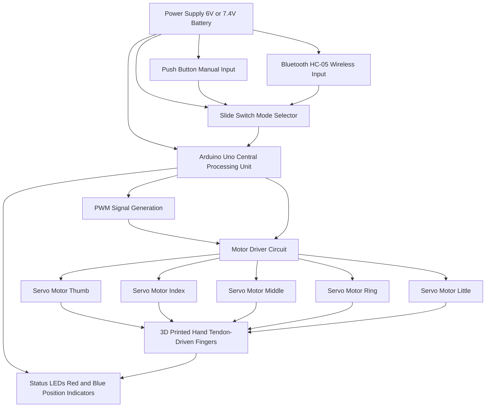

# **1. High-Level Data Flow**

```mermaid
flowchart LR
A[User Input Button Press or Bluetooth Command] --> B[Arduino Control Logic]
B --> C[Servo Command Generation PWM]
C --> D[Servo Actuation Tendon Pulling]
D --> E[Position Feedback Software State]
E --> B
B --> F[LED Indicators System Status]
```

---

# **2. Bluetooth Command Flow**

```mermaid
flowchart LR
A1[User Sends Command from Smartphone App] --> B1[HC-05 Receives Bluetooth Data]
B1 --> C1[HC-05 Converts to Serial and Sends to Arduino RX]
C1 --> D1[Arduino Reads Serial Buffer]
D1 --> E1[Character Compared with Command Definitions]
E1 --> F1[Execute Matching Servo Function]
F1 --> G1[Servos Move Accordingly]
G1 --> H1[Arduino Sends Confirmation via HC-05]
H1 --> I1[User Sees Feedback in App]
```

---

# **3. Manual Control Flow**

```mermaid
flowchart LR
A2[User Presses Push Button] --> B2[Arduino Detects Button State Change]
B2 --> C2[Check Current Finger Positions]
C2 --> D2[Determine Action Open or Close]
D2 --> E2[Execute Coordinated Movement Sequence]
E2 --> F2[Update Position Variables]
F2 --> G2[Return to Idle State]
```

---

```mermaid
flowchart TD

%% NODES
PS[Power Supply\n6V / 7.4V Battery]
PB[Push Button\nManual Input]
BT[Bluetooth HC-05\nWireless Input]
SW[Slide Switch\nMode Selector]
ARD[Arduino Uno\nCentral Processing Unit]
PWM[PWM Signal\nGeneration]
DRV[Motor Driver\nCircuit]

S1[Servo Motor\nThumb]
S2[Servo Motor\nIndex]
S3[Servo Motor\nMiddle]
S4[Servo Motor\nRing]
S5[Servo Motor\nLittle]

HAND[3D Printed Hand\nTendon-Driven Fingers]
LED[Status LEDs\nRed & Blue\nPosition Indicators]

%% CONNECTIONS
PS --> PB
PS --> BT
PS --> SW
PS --> ARD

PB --> SW
BT --> SW

SW -->|Mode Selection| ARD

ARD --> PWM
PWM --> DRV
ARD --> DRV

DRV --> S1
DRV --> S2
DRV --> S3
DRV --> S4
DRV --> S5

S1 --> HAND
S2 --> HAND
S3 --> HAND
S4 --> HAND
S5 --> HAND

ARD --> LED
HAND --> LED

%% COLORS
style PS fill:#F9E79F,stroke:#000,color:#000
style PB fill:#D6EAF8,stroke:#000
style BT fill:#D6EAF8,stroke:#000
style SW fill:#A9CCE3,stroke:#000
style ARD fill:#A3E4D7,stroke:#000
style PWM fill:#A3E4D7,stroke:#000
style DRV fill:#A3E4D7,stroke:#000
style S1 fill:#F5B7B1,stroke:#000
style S2 fill:#F5B7B1,stroke:#000
style S3 fill:#F5B7B1,stroke:#000
style S4 fill:#F5B7B1,stroke:#000
style S5 fill:#F5B7B1,stroke:#000
style HAND fill:#FADBD8,stroke:#000
style LED fill:#D6DBDF,stroke:#000
```

```mermaid
flowchart TD

PS[Power Supply 6V or 7.4V Battery]
PB[Push Button Manual Input]
BT[Bluetooth HC-05 Wireless Input]
SW[Slide Switch Mode Selector]
ARD[Arduino Uno Central Processing Unit]
PWM[PWM Signal Generation]
DRV[Motor Driver Circuit]

S1[Servo Motor Thumb]
S2[Servo Motor Index]
S3[Servo Motor Middle]
S4[Servo Motor Ring]
S5[Servo Motor Little]

HAND[3D Printed Hand Tendon-Driven Fingers]
LED[Status LEDs Red and Blue Position Indicators]

PS --> PB
PS --> BT
PS --> SW
PS --> ARD

PB --> SW
BT --> SW

SW --> ARD

ARD --> PWM
PWM --> DRV
ARD --> DRV

DRV --> S1
DRV --> S2
DRV --> S3
DRV --> S4
DRV --> S5

S1 --> HAND
S2 --> HAND
S3 --> HAND
S4 --> HAND
S5 --> HAND

ARD --> LED
HAND --> LED
```
